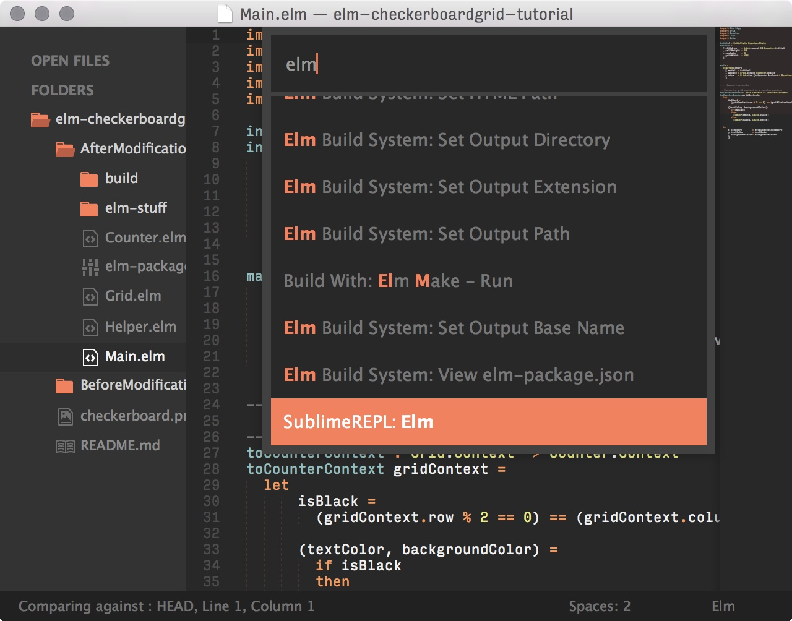
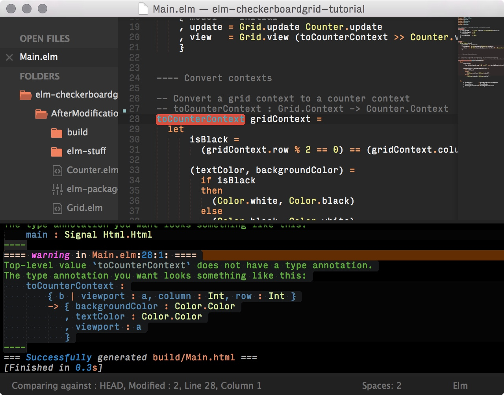
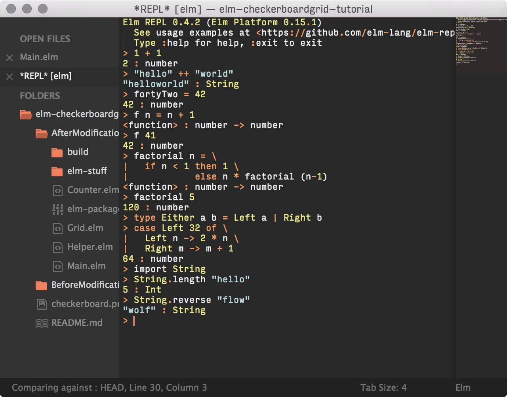
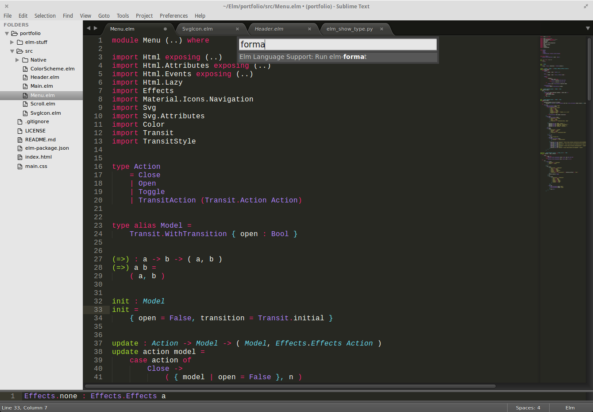

# The Sublime Elm Language Package

> This prerelease version provides experimental support for the just-released
> [Elm 0.19][], and **breaks compatibility** with Elm 0.18 and earlier.
>
> Please report issues on GitHub:
> <https://github.com/elm-community/SublimeElmLanguageSupport/issues>
>
> ## Help Welcome
>
> Are you interested in contributing to the Elm Language Support package for
> Sublime Text? Get in touch!

## Installation

1. Install [Package Control][]
2. Run `Package Control: Install Package` in the Command Palette (<kbd>Super+Shift+P</kbd>)
3. Install [Elm][] or use [NPM][] (`npm i -g elm`)

### Manual

1. Go to Packages directory
2. Clone the repository `git clone https://github.com/elm-community/SublimeElmLanguageSupport.git 'Elm Language Support'`

## Features

- Compatible with [Sublime Text 2] and [Sublime Text 3]
- Syntax highlighting
- Snippets for common Elm syntax (function, `case` … `of`, `let` … `in`, etc.)

  | Tab Trigger | Description                        |
  | ----------- | ---------------------------------- |
  | cof         | `case … of`                        |
  | cofm        | `case … of (Maybe)`                |
  | cofr        | `case … of (Result)`               |
  | debug       | `Debug.log`                        |
  | fn          | `Function (a -> b)`                |
  | fn2         | `Function (a -> b -> c)`           |
  | fn3         | `Function (a -> b -> c -> d)`      |
  | fn4         | `Function (a -> b -> c -> d -> e)` |
  | imp         | `import`                           |
  | impas       | `import … as`                      |
  | let         | `let … in …`                       |
  | mod         | `module`                           |
  | type        | `type`                             |
  | typea       | `type alias (Record)`              |

- Four standard build commands (<kbd>Super+[Shift]+B</kbd> or <kbd>Super+[Shift]+F7</kbd>)
  1. `Build` just checks errors. Kudos to this [tweet][]!
  2. `Run` additionally outputs your compiled program to an inferred path.
  3. The same as the above two, but ignoring warnings
  4. Output path is configurable in `elm-package.json` or `Elm Build System: …` in the Command Palette. Elm build system only requires a valid config in any ancestor directory of the active file. 
- Compile messages
  1. Navigate errors and warnings (<kbd>Super+[Shift]+F4</kbd>).
  2. Formatted for build output panel.
  3. Compile message highlighting, embedded code highlighting, and color scheme for output panel. 
- Integration with popular plugins (installed separately)
  1. [SublimeREPL][] — Run `elm-repl` in an editor tab with syntax highlighting. 
- Integration with [elm format](https://github.com/avh4/elm-format)
  1. Make sure `elm-format` is in your PATH
  2. Run the "Elm Language Support: Run elm-format" command from the Command Palette to run elm-format on the current file
  3. To enable automatic formatting on every save, Go to Preferences -> Package Settings -> Elm Language Support -> Settings and add this setting:
     `"elm_format_on_save": true`
  4. If there are certain Elm source files you don't want to automatically run `elm-format` on, for example elm-css based files, you can set a regex filter which will search the full filename (including the path to the file). If the regex matches, then it will not automatically run `elm-format` on the file when you save. For example, the following filter would prevent automatic `elm-format` on a file named `elm-css/src/Css/TopBar.elm`:
     `"elm_format_filename_filter": "elm-css/src/Css/.*\\.elm$"`
- Project-specific settings

  Need to configure a setting (such as `elm_format_binary`) per-project? Prefix the name of the setting with `elm_language_support_` and add it to your project settings file.

  ```
  {
    "folders":
    [
      {
        "path": "."
      }
    ],
    "settings":
    {
      "elm_language_support_elm_format_binary": "node_modules/elm-format/unpacked_bin/elm-format"
    }
  }
  ```

## Troubleshooting

- I have `elm-oracle` installed, but completions, type signature display, and the type panel don't work
  1. Make sure `elm-oracle` is on your PATH, or
  2. Add the absolute path of the directory containing `elm-oracle` to the `elm_paths` setting in your Elm Language Support User settings
- I have `elm-format` installed, but it's not working
  1. Make sure `elm-format` is on your PATH, or
  2. Add the absolute path of the directory containing `elm-format` to the `elm_paths` setting in your Elm Language Support User settings. Note that you can combine paths with `:`, for example `"elm_paths": "/users/alex/elm-format/bin:/users/alex/elm-oracle/bin"`.
  3. If using an alternate name for the binary (`elm-format-0.19`), adjust the `elm_format_binary` setting in your Elm Language Support User settings. This can be relative to your project directory. For example, if you want to use the NPM package version of `elm-format` installed locally in your project, use `"elm_format_binary": "node_modules/elm-format/unpacked_bin/elm-format"`.
- Elm format automatically runs every time I save a file, but there are some files I don't want it to run on
  1. If there are certain Elm source files you don't want to automatically run `elm-format` on, for example elm-css based files, you can set a regex filter which will search the full filename (including the path to the file). If the regex matches, then it will not automatically run `elm-format` on the file when you save. For example, the following filter would prevent automatic `elm-format` on a file named `elm-css/src/Css/TopBar.elm`:
     `"elm_format_filename_filter": "elm-css/src/Css/.*\\.elm$"`

## Learning

Don't know Elm? Great first step!

- [Elm Website][]
- [elm-discuss group][]
- [Pragmatic Studio: Building Web Apps with Elm][pragmatic]
- [Elm Town Podcast][]

[elm-discuss group]: https://groups.google.com/d/forum/elm-discuss
[elm]: http://elm-lang.org/install
[elm town podcast]: https://elmtown.github.io
[elm website]: http://elm-lang.org
[highlight build errors]: https://packagecontrol.io/packages/Highlight%20Build%20Errors
[npm]: https://nodejs.org
[package control]: https://packagecontrol.io/installation
[pragmatic]: https://pragmaticstudio.com/elm
[sublimerepl]: https://packagecontrol.io/packages/SublimeREPL
[sublime text 2]: http://www.sublimetext.com/2
[sublime text 3]: http://www.sublimetext.com/3
[tweet]: https://twitter.com/rtfeldman/status/624026168652660740
[elm 0.19]: https://elm-lang.org/blog/small-assets-without-the-headache
